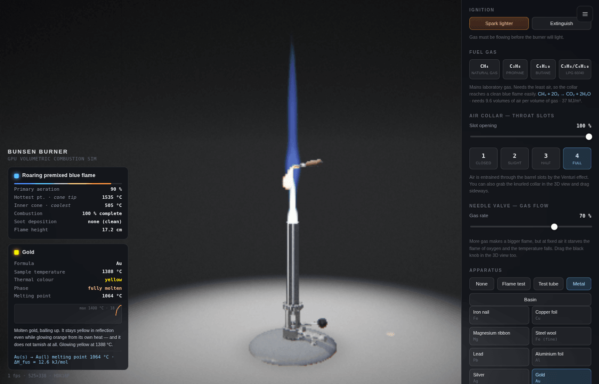
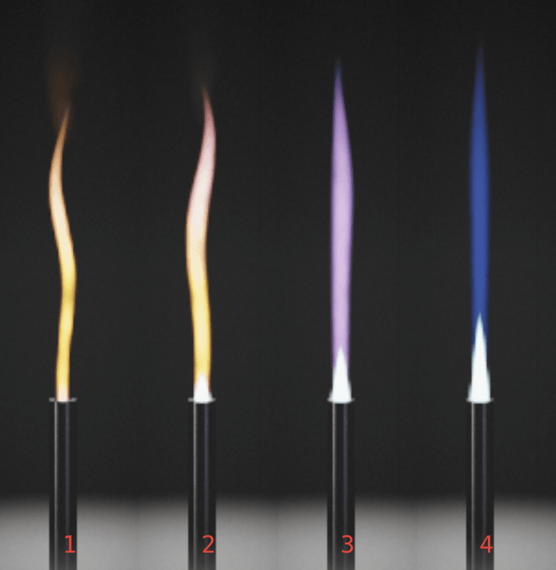
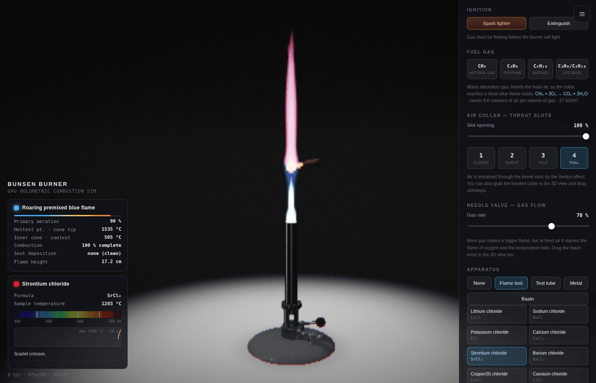
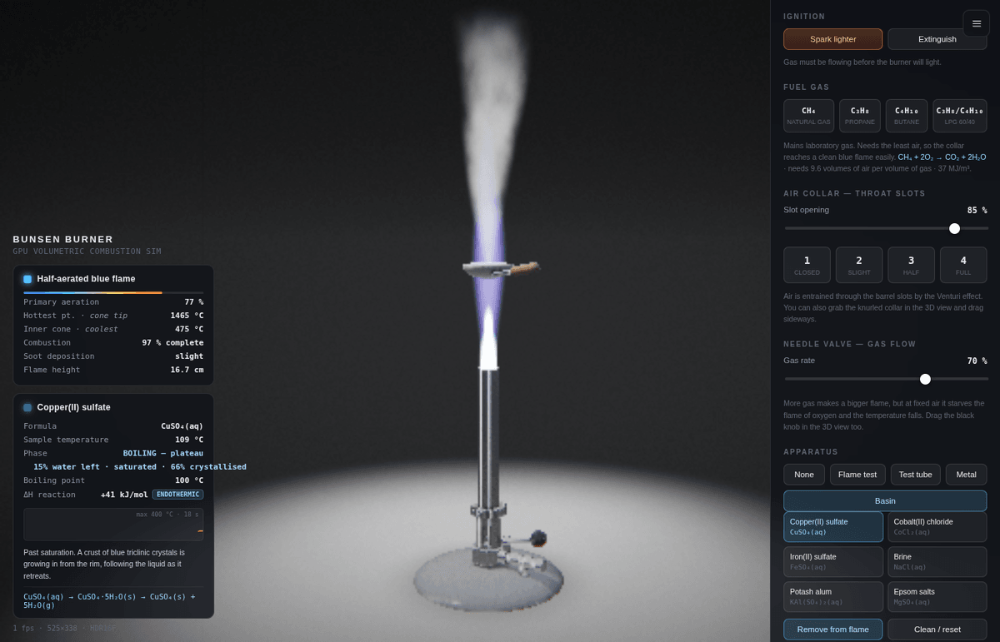

# Bunsen Burner Simulator

A physically-motivated Bunsen burner in a single HTML file. Real-time GPU volumetric combustion, a working air collar and needle valve, and forty heatable samples across four pieces of apparatus.

No build step, no dependencies, no network access. Open the file and it runs.



---

## The four flames

Primary aeration — how much air the throat slots let the Venturi effect entrain — is the one variable that matters. Everything else follows from it.



| | Collar | What you get | Why |
|---|---|---|---|
| **1** | Closed | Luminous yellow "safety flame", wavering, sooty, cool | Gas meets air only at the point of combustion. Incomplete burning leaves soot particles which glow by incandescence. |
| **2** | Slightly open | White-hot base, sooty orange plume fading red at the tip | A small premixed cone forms. Still soot-rich above it. |
| **3** | Half open | Pale blue inner cone, faint violet mantle | Soot largely gone. Chemiluminescence replaces incandescence. |
| **4** | Fully open | Sharp teal inner cone, near-invisible blue mantle, audible roar | Near-stoichiometric premix. Hottest, cleanest, and easy to lose against a bright background. |

The hottest point is the **tip of the inner cone**; the coolest part is the **body of the inner cone**. The readout reports both.

---

## Quick start

```bash
git clone https://github.com/<you>/bunsen-burner-simulator.git
cd bunsen-burner-simulator
open bunsen-burner-simulator.html      # macOS · or just double-click it
```

Any modern browser with **WebGL 2** works. Serving over HTTP is optional but tidier:

```bash
python3 -m http.server 8000
# → http://localhost:8000/bunsen-burner-simulator.html
```

---

## Controls

| Input | Action |
|---|---|
| Drag background | Orbit the camera |
| Scroll | Zoom |
| Drag the knurled collar | Open / close the throat slots |
| Drag the black valve knob | Gas rate |
| Double-click | Light / extinguish |
| `1` `2` `3` `4` | Jump to the four canonical flames |
| `Space` | Light / extinguish |
| `L` / `S` | Labels / sound |
| `H` | Hide the control panel |
| `R` | Reset the view |
| `Ctrl/⌘ S` · `Ctrl/⌘ O` | Save / load a setup file |

The camera auto-frames whatever apparatus is in use; turn it off under **View**.

---

## Apparatus and samples

**40 samples across four rigs.** Each carries real onset temperatures, reaction enthalpies and observations.

<details>
<summary><b>Flame test</b> — nichrome loop, 11 salts</summary>

Lithium, sodium, potassium, calcium, strontium, barium, copper(II), caesium, rubidium chloride, boric acid, lead(II) nitrate.

Emission colours are driven by each salt's actual spectral lines, shown on a wavelength strip. Sodium contaminates the wire and swamps everything else until you clean it — as it does in reality.


</details>

<details>
<summary><b>Test tube</b> — 12 samples including boiling and deflagration</summary>

Water, hydrogen, lycopodium powder, copper(II) sulfate-5-water, copper(II) carbonate, potassium manganate(VII), lead(II) nitrate, iodine, sulfur, zinc oxide, ammonium chloride, sucrose.

Water pins at 100 °C and bumps. Hydrogen gives the squeaky pop. Lycopodium powder chars quietly in a heap but flashes into rolling fireballs once dispersed — the flour-mill mechanism.
</details>

<details>
<summary><b>Metal</b> — tongs, 11 specimens that creep, melt, drip and boil</summary>

Iron nail, copper foil, magnesium ribbon, steel wool, lead, aluminium foil, silver, gold, titanium, mercury, platinum wire.

Each metal carries its melting point and latent heat of fusion. Specimens droop under thermal creep before melting, plateau at the melting point while latent heat is absorbed, then ball up and drip. Droplets fall under gravity, cool in flight, and freeze into a puddle.

Aluminium is the interesting one: it melts inside at 660 °C but the Al₂O₃ skin melts at 2072 °C and holds the shape, so it sags rather than drips. Titanium deliberately **cannot** be melted — 1668 °C is out of reach of any Bunsen — so it goes white-hot and runs through oxide interference colours instead.
</details>

<details>
<summary><b>Evaporating basin</b> — 6 solutions, crystallised from water</summary>

Copper(II) sulfate, cobalt(II) chloride, iron(II) sulfate, brine, potash alum, Epsom salts.

Three stages: boil down (the boiling point rises as the liquor concentrates), crystallise (a crust grows on the bowl wall and creeps inward as the liquid retreats), then dehydrate. Cobalt(II) chloride is the showpiece — pink hydrate to blue anhydrous at 110 °C, the indicator in silica gel.


</details>

### Fuel gases

| Fuel | Air required | Calorific value | Max flame temp |
|---|---:|---:|---:|
| Natural gas (CH₄) | 9.55 vol | 37.0 MJ/m³ | 1560 °C |
| Propane (C₃H₈) | 23.90 vol | 93.0 MJ/m³ | 1690 °C |
| Butane (C₄H₁₀) | 31.00 vol | 121.5 MJ/m³ | 1670 °C |
| LPG 60/40 | 26.75 vol | 104.4 MJ/m³ | 1680 °C |

Switching fuel changes what the same collar setting means: propane needs 2½× the air of methane, so a setting that runs clean on mains gas runs rich on a cylinder.

---

## Saving setups

**Setup files** in the control panel writes a small, readable, versioned JSON document. Drag a saved file onto the 3D view to load it.

```json
{
  "format": "bunsen-burner-simulator/settings",
  "version": 1,
  "burner":    { "fuel": "butane", "airCollar": 0.9, "gasValve": 0.66, "lit": true },
  "apparatus": { "rig": "metal", "sample": "pb", "inFlame": true },
  "view":      { "lightsOut": true }
}
```

Every field is optional. Missing values are left alone, numbers are clamped to their valid range, and unknown fuels, apparatus or samples are skipped with a warning rather than failing. Eight built-in scenarios use the same code path, so they double as worked examples of the format.

---

## How it works

Everything is procedural. There are no meshes, textures or asset files.

**Geometry** — the burner, apparatus and specimens are signed distance fields, sphere-traced in a fragment shader. The air collar is a real rotating sleeve whose slots align with the barrel's; melting metals are domain-warped in the SDF so they droop and ball up.

**Flame** — an emission/absorption volumetric raymarch. Density comes from advected FBM noise; the amount of turbulence, the sway, the rise rate and the height of the premixed inner cone are all functions of primary aeration. Emission blends soot incandescence against C₂/CH chemiluminescence by soot fraction, which is why the flame walks from yellow through orange and violet to teal as the collar opens.

**Incandescence** — hot solids use the real Planckian locus (Kim et al. cubic fit → CIE xy → linear sRGB) with radiance scaled steeply against temperature. Nothing glows below ~525 °C, the Draper point, and the progression through dull red, cherry, orange, yellow and white-hot is emergent: the red channel clips under the ACES tonemap while green catches up.

**Pipeline** — HDR `RGBA16F` target → threshold → 3-level mip bloom → ACES filmic tonemap, with heat shimmer, chromatic aberration, vignette and grain. Blast effects add an expanding fireball shell, a full-frame flash and a refracting shockwave.

**The bench is deliberately static.** It has its own shader that is a pure function of surface position — baked texture, fixed light pool, fixed contact shadow — and never enters the material pipeline. It also carries a bloom mask in the alpha channel, feathered over the range where it dissolves into the backdrop. The result is a tabletop that renders identically whatever is burning: measured at RGB 167,167,167 for an unlit burner, a blue flame, a yellow flame, a sodium flame test and burning magnesium alike.

### Physical model

| Quantity | Model |
|---|---|
| Primary aeration | `air / (0.30 + 0.78 · gas)` — more gas at fixed air leans the mixture out |
| Flame temperature | Fuel-specific maximum, scaled by aeration, penalised by excess gas |
| Combustion completeness | Derived from soot fraction |
| Melting | Latent-heat plateau at the melting point; creep from ~0.74 Tm in kelvin |
| Boiling | Temperature pins at the boiling point; solute elevates it as the liquor concentrates |
| Reaction energy | Per-sample ΔH plus a self-heating term — exothermic reactions run away, endothermic ones plateau |
| Strike-back | Rich air with starved gas burns back at the jet; the barrel heats visibly |
| Lift-off | Excess gas at full aeration lifts the flame off the tube, then blows it out |

A live temperature trace with the onset marked makes the plateaus and runaways legible.

---

## Performance

Four quality tiers control the volumetric step count (40–132) and internal resolution, with adaptive downscaling if the frame rate drops. The FPS readout shows the real rate and the internal buffer size.

Software rendering (SwiftShader, headless CI) works but is very slow — expect roughly 1 fps. Any discrete or integrated GPU from the last decade handles it comfortably.

Falls back to `RGBA8` render targets if `EXT_color_buffer_float` is unavailable.

---

## Repository layout

```text
bunsen-burner-simulator.html    the entire application (~3,500 lines, self-contained)
docs/                           screenshots used by this README
README.md
```

---

## A note on the demonstrations

Everything modelled here is standard school-laboratory or industrial-safety teaching material: the hydrogen squeaky-pop test, lycopodium dust deflagration as an illustration of why grain silos explode, thermal decomposition, flame tests, crystallisation. There are no formulations, quantities or procedures for energetic materials.

Several sequences exist to show why a real lab does things the way it does — mercury vapour toxicity, the danger of heating a tube pointed at someone, glass softening, boiling bumping, strike-back. Read the observation text; that is where the reasoning lives.

---

## Credits

- Flame classification and burner mechanics follow the [Bunsen burner](https://en.wikipedia.org/wiki/Bunsen_burner) article.
- Planckian locus approximation: Kim et al., *Design of Advanced Color Temperature Control System for HDTV Applications*.
- ACES filmic tonemap curve: Krzysztof Narkowicz's analytic fit.
- Bloom: the mip down/upsample chain from Jorge Jimenez's *Next Generation Post Processing in Call of Duty: Advanced Warfare*.
- SDF primitives after Inigo Quilez.

## License

MIT — see [LICENSE](LICENSE).
